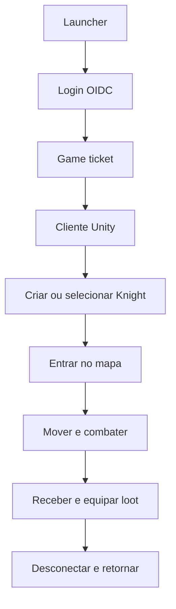
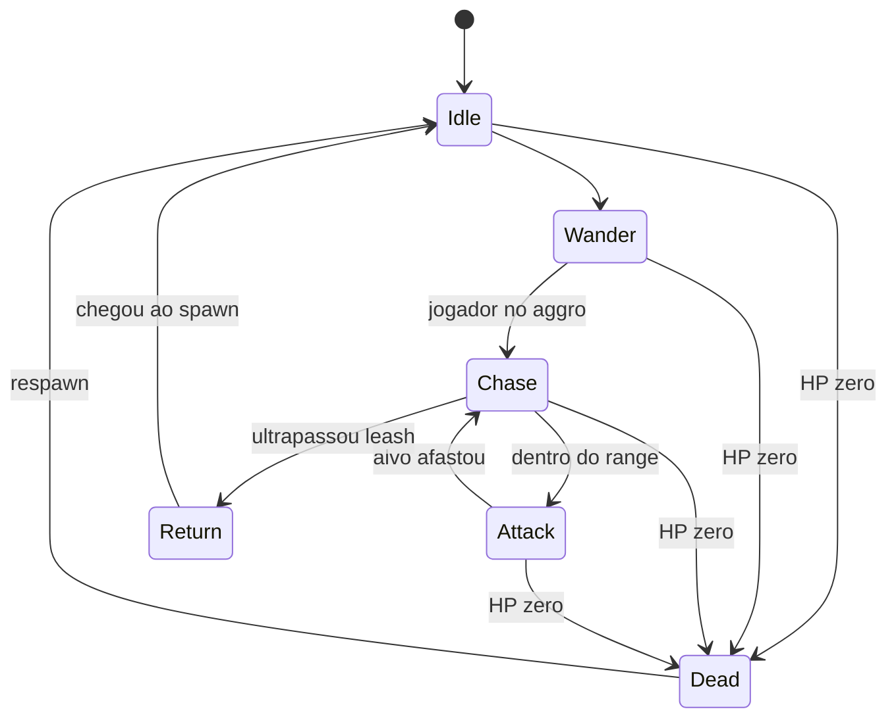
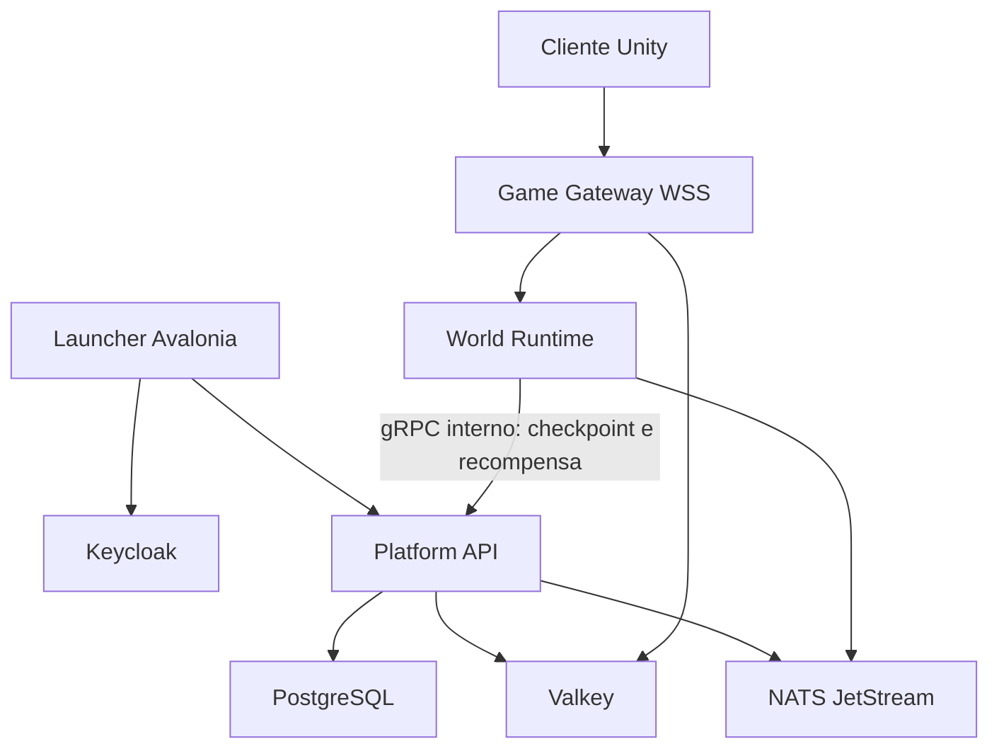

# GDD técnico — Vertical Slice do MMO 2D top-down

**Código do milestone:** MMO-VS1  
**Versão:** 1.0  
**Data:** 31 de agosto de 2026  
**Documento-base:** Blueprint técnico do MMO, versão 1.2  
**Objetivo:** transformar as decisões de produto em uma primeira fatia vertical jogável, online, autoritativa e persistente.

---

## 1. Resultado esperado

Ao final do vertical slice, uma pessoa deverá conseguir:

1. abrir o launcher;
2. autenticar pela conta;
3. iniciar o cliente Unity com um ticket de uso único;
4. criar ou selecionar um Knight;
5. entrar em um mapa top-down;
6. mover-se usando click-to-move ou WASD;
7. lutar contra um monstro;
8. usar ataque básico e uma habilidade;
9. receber XP, skill XP, moeda e um drop;
10. colocar o item no inventário e equipá-lo;
11. desconectar;
12. reconectar com level, posição, HP, inventário e equipamento preservados;
13. repetir o fluxo com 100 clientes automatizados sem criar XP, moeda ou itens duplicados.

O vertical slice não é uma demo visual. Ele é uma prova de que o caminho crítico do MMO funciona de ponta a ponta:

> Login → sessão → mapa → movimento → combate → recompensa → persistência → reconexão.

---

## 2. Gate de aprovação

O milestone será considerado aprovado somente quando:

- o servidor for a autoridade de movimento, combate, XP, loot e inventário;
- modificar ou repetir um pacote não gerar vantagem;
- uma recompensa não puder ser concedida duas vezes;
- duas conexões não puderem controlar o mesmo personagem;
- uma interrupção de rede não duplicar sessão, monstro, item ou moeda;
- os testes de integração e carga passarem automaticamente;
- logs e traces permitirem reconstruir uma morte de monstro e a concessão do loot;
- o cliente sustentar 60 FPS no cenário de teste;
- o servidor sustentar 100 conexões automatizadas no ambiente de integração.

Falhar em qualquer um desses pontos impede o avanço para quatro vocações, dungeons ou hunt idle.

---

## 3. Escopo funcional

### Incluído

- launcher funcional mínimo;
- login OIDC com PKCE;
- game ticket de uso único;
- criação/seleção de um Knight;
- um mapa top-down;
- movimento contínuo;
- quatro orientações visuais;
- click-to-move e WASD;
- um monstro;
- ataque básico;
- uma habilidade de Knight;
- IA simples;
- HP, MP, morte e respawn;
- XP de personagem;
- XP de habilidade;
- moeda;
- loot pessoal;
- inventário com 20 slots;
- um equipamento com Normal, Good e Rare;
- equipar/desequipar;
- persistência;
- disconnect/reconnect;
- telemetria, auditoria e bots de carga.

### Não incluído

- Archer, Priest ou Dark Mage;
- party, friends, chat ou guilda;
- dungeon, boss ou matchmaking;
- hunt idle;
- quests completas;
- crafting, trade ou marketplace;
- PvP;
- pets ou montarias;
- loja ou monetização;
- Steam;
- mapa em chunks carregados remotamente;
- arte final;
- anti-cheat de kernel;
- Kubernetes, Agones ou Open Match.

Esses sistemas não devem aparecer parcialmente no código do vertical slice. Interfaces futuras podem ser previstas, mas não implementadas sem necessidade atual.

---

## 4. Configuração do cliente

| Propriedade | Definição do vertical slice |
|---|---|
| Engine | Unity 6.3 LTS |
| Render | URP 2D |
| Plataforma | Windows x64 |
| Resolução de referência | 1920×1080 |
| Interface | Escalável para 1280×720 a 3840×2160 |
| Frame rate | 60 FPS |
| Perspectiva | Top-down ortogonal |
| Unidade lógica | 1 célula = 1 unidade de mundo |
| Arte provisória | 64 pixels por unidade |
| Orientações | Norte, sul, leste e oeste |
| Movimento | Contínuo; click-to-move e WASD |
| Diagonal | Permitida; velocidade normalizada |
| Tick público | 10 Hz no servidor |
| Interpolação | 60 FPS no cliente |

### Regra das quatro direções

O personagem possui apenas quatro estados de orientação:

```text
North
South
East
West
```

Quando existe movimento diagonal:

1. o vetor é normalizado para não aumentar a velocidade;
2. a orientação visual usa o eixo com maior magnitude;
3. em caso de empate, preserva-se a última orientação cardinal válida;
4. não existem sprites ou animações diagonais.

Essa regra deve ser uma função compartilhada e testada, não condições duplicadas em vários componentes do cliente.

---

## 5. Fluxo do jogador



### Primeiro acesso

1. launcher abre o navegador do sistema;
2. usuário autentica;
3. launcher recebe Authorization Code via loopback e troca usando PKCE;
4. launcher solicita `game_ticket` com TTL de 30 segundos;
5. launcher abre o Unity;
6. cliente recebe o ticket por IPC local/named pipe;
7. gateway consome o ticket atomicamente;
8. jogador cria um Knight com nome válido;
9. servidor posiciona o personagem no spawn seguro;
10. cliente recebe snapshot inicial.

### Retorno

1. conta autentica novamente;
2. novo ticket é emitido;
3. jogador seleciona o Knight;
4. servidor recupera o último checkpoint válido;
5. posição insegura é convertida para o safe spawn;
6. inventário, equipamento, XP, HP e MP são restaurados.

---

## 6. Mapa do vertical slice

### Identificação

| Campo | Valor |
|---|---|
| ID estável | `map_training_field_01` |
| Nome provisório | Campo de Treinamento |
| Tipo | Mapa público PvE |
| Dimensão | 96×96 células |
| Tile lógico | 1×1 unidade |
| Chunks de dados | 16×16 células |
| Jogadores de teste | 100 conectados |
| Monstros ativos | Até 30 |
| Canais | 1 no vertical slice |

O nome visível é provisório. IDs técnicos não devem depender do nome de lore.

### Zonas

| Zona | Função |
|---|---|
| Safe Spawn | criação, respawn e reconexão segura |
| Corredor de Movimento | obstáculos para validar click-to-move e WASD |
| Campo de Combate | spawns do monstro |
| Área de Leash | limite de perseguição da IA |
| Parede de Colisão | validação de speedhack e atravessar objetos |
| Ponto de Equipamento | área visual para abrir inventário e comparar defesa |

### Dados do mapa

O mapa será produzido no Tiled e exportado para um formato intermediário validado. O build de conteúdo gera dois artefatos a partir da mesma fonte:

- dados visuais para Unity;
- dados autoritativos para o servidor.

O servidor recebe somente o necessário:

- bounds;
- células bloqueadas;
- regiões;
- spawns;
- pontos seguros;
- triggers;
- versão/hash do conteúdo.

O cliente nunca define sozinho onde existe parede, spawn ou zona segura.

---

## 7. Personagem do vertical slice

### Knight

| Atributo level 1 | Valor provisório |
|---|---:|
| HP máximo | 120 |
| MP máximo | 40 |
| Ataque | 12 |
| Defesa | 8 |
| Crítico | 5% |
| Multiplicador crítico | 1,5× |
| Velocidade | 4,5 unidades/s |
| Regeneração de HP | 1/s fora de combate |
| Regeneração de MP | 2/s fora de combate |

Todos os valores vêm do catálogo versionado. Nenhum valor de balanceamento deve ficar espalhado em `MonoBehaviour` ou handler de rede.

### Estados

- Idle;
- Moving;
- BasicAttack;
- Casting;
- Hit;
- Stunned;
- Dead;
- Respawning.

O servidor controla o estado lógico. O Animator do cliente representa esse estado e pode antecipar apenas efeitos visuais reversíveis.

---

## 8. Controles e movimento

### Click-to-move

- botão esquerdo em célula navegável solicita movimento;
- cliente calcula uma rota visual provisória;
- servidor calcula/valida a rota autoritativa;
- clique fora do mapa ou em célula bloqueada é rejeitado;
- novo clique substitui o destino anterior;
- atacar ou receber stun pode interromper a rota.

### WASD

- entradas são amostradas pelo cliente;
- cliente envia `MoveIntent` com vetor e sequência;
- servidor normaliza o vetor;
- colisão e velocidade são calculadas no servidor;
- cliente prevê o movimento próprio;
- snapshot autoritativo reconcilia diferenças.

### Regras server-side

- velocidade máxima de 4,5 unidades/s;
- diagonal normalizada;
- distância máxima por tick;
- nenhuma passagem por célula bloqueada;
- posição deve permanecer dentro do mapa;
- personagem morto ou stunned não se move;
- pacotes atrasados ou repetidos são ignorados;
- correção suave para erro pequeno e snap para erro grave;
- teleporte exige comando interno do servidor.

### Persistência de posição

Posição não é salva a cada tick. O servidor mantém o estado em memória e grava checkpoint:

- a cada 10 segundos;
- ao sair do mapa;
- ao desconectar normalmente;
- ao receber shutdown gracioso;
- ao morrer/respawnar.

---

## 9. Combate

### Ataque básico — Corte de Treino

| Campo | Valor |
|---|---:|
| ID | `knight_basic_slash` |
| Tipo | Target melee |
| Range | 1,5 unidade |
| Cooldown | 0,8 s |
| Custo | 0 MP |
| Coeficiente | 1,0 |
| Poder base | 2 |

### Skill — Golpe de Escudo

| Campo | Valor |
|---|---:|
| ID | `knight_shield_bash_r1` |
| Tipo | Target melee/control |
| Range | 1,4 unidade |
| Cooldown | 5 s |
| Custo | 10 MP |
| Coeficiente | 1,2 |
| Poder base | 8 |
| Controle | Stun de 1,25 s |
| Skill XP | 1 por acerto válido |

### Fórmula provisória

```text
rawDamage = attack × coefficient + basePower
mitigation = defense ÷ (defense + 100)
variance = serverRandom(0.95, 1.05)
damage = max(1, floor(rawDamage × (1 - mitigation) × variance))
criticalDamage = floor(damage × 1.5)
```

RNG é gerado no servidor. O cliente recebe o resultado e as flags necessárias para animação.

### Validações de ataque

- atacante e alvo existem;
- ambos pertencem ao mesmo mapa/canal;
- atacante está vivo;
- alvo está vivo e pode ser atacado;
- habilidade pertence à classe;
- MP suficiente;
- cooldown concluído no relógio do servidor;
- range válido;
- linha de movimento/colisão válida quando aplicável;
- atacante não está stunned;
- sequência ainda não foi processada;
- limite de mensagens não foi excedido.

O cliente envia `AttackIntent` ou `CastIntent`. Nunca envia dano, crítico, morte, XP ou cooldown final.

---

## 10. Monstro

### Slime de Musgo

| Campo | Valor provisório |
|---|---:|
| ID | `mob_moss_slime_l1` |
| Level | 1 |
| HP | 45 |
| Ataque | 6 |
| Defesa | 2 |
| Velocidade | 2,8 unidades/s |
| Aggro | 6 unidades |
| Leash | 10 unidades do spawn |
| Range de ataque | 1,1 unidade |
| Cooldown de ataque | 1,5 s |
| Respawn | 8 s |
| XP | 20 |

### Máquina de estados



### Regras de IA

- decisão autoritativa no World Runtime;
- path não recalculado mais de quatro vezes por segundo;
- alvo escolhido por proximidade no vertical slice;
- perde alvo morto, desconectado ou fora do leash;
- ao retornar, regenera HP e não concede recompensa sem uma nova morte válida;
- morte possui `kill_id` único.

---

## 11. Progressão

### Level do personagem

| Level | XP acumulado necessário |
|---:|---:|
| 1 | 0 |
| 2 | 100 |
| 3 | 240 |

O vertical slice limita o personagem ao level 3. O schema suporta level 30 sem mudança estrutural.

### Skill XP

- Golpe de Escudo recebe 1 XP por acerto válido;
- não recebe XP ao errar, usar no vazio ou acertar alvo já morto;
- `skill_action_id` impede repetir o mesmo acerto;
- rank 2 provisório exige 20 XP;
- rank máximo do vertical slice: 2.

### Recompensa de morte

O servidor cria um `kill_id` e calcula participantes elegíveis. No vertical slice há somente loot individual para o responsável pela morte.

Concessão usa chave idempotente:

```text
reward_key = kill_id + character_id
```

Uma constraint única impede a segunda concessão, mesmo após retry, reconnect ou evento duplicado.

---

## 12. Loot, inventário e equipamento

### Tabela provisória do Slime

| Recompensa | Chance | Quantidade |
|---|---:|---:|
| Moeda de treino | 100% | 1–3 |
| Poção pequena | 20% | 1 |
| Escudo de Madeira — Normal | 8% | 1 |
| Escudo de Madeira — Good | 2% | 1 |
| Escudo de Madeira — Rare | 0,5% | 1 |

QA terá uma loot table determinística separada. Não aumentar chances de produção dentro do código para facilitar testes.

### Escudo de Madeira

| Raridade | Defesa | Affix |
|---|---:|---|
| Normal | +3 | nenhum |
| Good | +4 | +1% bloqueio |
| Rare | +5 | +2% bloqueio |

Campos:

- template: `knight_wooden_shield_t0`;
- classe: Knight;
- slot: OffHand;
- level mínimo: 1;
- tier: 0;
- durabilidade máxima: 20;
- bind: ao equipar;
- instance ID: UUIDv7 gerado no servidor.

### Fluxo de loot

1. monstro morre com `kill_id` único;
2. servidor calcula loot;
3. moeda é lançada no ledger;
4. item recebe instance ID;
5. `reward_grant` e alterações são persistidos na mesma transação;
6. cliente recebe `RewardGranted`;
7. UI atualiza somente depois da confirmação.

### Inventário

- 20 slots;
- itens empilháveis possuem limite por template;
- equipamento não é empilhável;
- mover item usa versão otimista do inventário;
- equipar valida owner, classe, level, slot, bind e durabilidade;
- inventário cheio impede item físico, mas não moeda;
- no vertical slice, item não concedido por inventário cheio fica em `pending_reward` para resgate, nunca no chão público.

### Morte do personagem

- tela de morte por 5 segundos;
- respawn no Safe Spawn;
- nenhum XP ou level perdido;
- cada equipamento durável perde 1 ponto;
- item com durabilidade zero permanece equipado, mas não concede atributos;
- reparo é uma ação de desenvolvimento no vertical slice; NPC entra depois.

---

## 13. Telas e interface mínimas

### Launcher

- status do serviço;
- login/logout;
- versão do cliente;
- botão Jogar;
- progresso de atualização;
- mensagem de erro acionável.

### Seleção de personagem

- um slot de personagem;
- criar Knight;
- validar nome;
- selecionar;
- entrar no mundo.

### HUD

- nome e level;
- HP e MP;
- barra de XP;
- alvo atual;
- ataque básico;
- Golpe de Escudo;
- cooldown visível;
- feedback de dano/crítico;
- estado de conexão.

### Inventário

- grade de 20 slots;
- tooltip do item;
- raridade;
- comparação de defesa;
- equipar/desequipar;
- slot OffHand;
- saldo de moeda.

Arte e UI podem ser provisórias, mas estados de loading, erro, vazio e reconexão são obrigatórios.

---

## 14. Arquitetura executável



### Deployables

| Processo | Responsabilidade |
|---|---|
| Launcher | login, atualização, ticket e abertura segura |
| Platform API | personagem, checkpoint, inventário, economia e conteúdo persistente |
| Game Gateway | conexão, autenticação, rate limit e roteamento |
| World Runtime | movimento, IA e combate |
| Content Builder | valida e gera conteúdo cliente/servidor |
| Load Bot | simula clientes sem renderização |

### Ambiente local

Docker Compose sobe:

- PostgreSQL 18;
- Keycloak;
- Valkey;
- NATS JetStream;
- OpenTelemetry Collector;
- Prometheus/Grafana opcional no perfil `observability`.

Unity e launcher rodam fora dos contêineres durante desenvolvimento.

World Runtime não escreve diretamente no PostgreSQL. Checkpoints e recompensas passam por contratos internos da Platform API. Eventos críticos só são publicados no NATS depois do commit, por meio do outbox transacional.

---

## 15. Contrato de rede

### Transporte

- WSS em 443;
- payload binário;
- Protocol Buffers;
- protocolo versionado;
- limite padrão de 64 KiB por mensagem;
- mensagens maiores rejeitadas antes do parse completo.

### Envelope conceitual

```proto
message ClientEnvelope {
  uint32 protocol_version = 1;
  uint64 sequence = 2;
  uint64 client_tick = 3;
  oneof payload {
    ClientHello hello = 10;
    JoinWorld join_world = 11;
    MoveIntent move = 12;
    AttackIntent attack = 13;
    CastIntent cast = 14;
    EquipItemIntent equip = 15;
    Heartbeat heartbeat = 16;
  }
}

message ServerEnvelope {
  uint32 protocol_version = 1;
  uint64 server_tick = 2;
  uint64 ack_sequence = 3;
  oneof payload {
    JoinAccepted join_accepted = 10;
    WorldSnapshot snapshot = 11;
    CombatEvent combat = 12;
    RewardGranted reward = 13;
    InventoryDelta inventory = 14;
    Correction correction = 15;
    ServerError error = 16;
  }
}
```

### Mensagens do cliente

- `ClientHello`;
- `JoinWorld`;
- `MoveIntent`;
- `AttackIntent`;
- `CastIntent`;
- `EquipItemIntent`;
- `UnequipItemIntent`;
- `Heartbeat`;
- `ReconnectRequest`.

### Mensagens do servidor

- `JoinAccepted`;
- `WorldSnapshot`;
- `EntitySpawned`;
- `EntityDespawned`;
- `CombatEvent`;
- `SkillStateChanged`;
- `RewardGranted`;
- `InventoryDelta`;
- `CharacterProgressed`;
- `Correction`;
- `ServerError`;
- `MaintenanceNotice`.

### Rate limits iniciais

| Categoria | Limite por sessão |
|---|---:|
| MoveIntent | 20/s |
| Attack/Cast | 10/s combinados |
| Inventory/Equip | 5/s |
| Heartbeat | 2/s |
| Handshake anônimo | 3/min por IP |

Limite excedido gera métrica, resposta controlada e, em reincidência, desconexão. Nunca realizar trabalho caro antes de autenticação e validação de tamanho.

---

## 16. Sessão e reconexão

### Game ticket

- TTL de 30 segundos;
- uso único;
- vinculado a account ID, build, protocol version e nonce;
- consumido atomicamente;
- nunca aparece em URL, log ou argumento de linha de comando.

### Session lease

- apenas uma conexão possui o personagem;
- lease renovado por heartbeat;
- reconnect token rotacionável e curto;
- nova sessão invalida conexão anterior somente após prova de conta e política explícita;
- corrida entre duas conexões resulta em um único owner.

### Disconnect

- queda abrupta mantém o personagem por até 10 segundos se estiver em combate;
- session grace total de 30 segundos;
- reconnect dentro da janela reassocia a conexão ao mesmo actor;
- após expiração, salva checkpoint e remove personagem do mapa;
- reconnect nunca reaplica o último `RewardGranted`.

---

## 17. Modelo de dados mínimo

### Tabelas

- `accounts_projection`;
- `characters`;
- `character_checkpoints`;
- `character_stats`;
- `character_skills`;
- `item_templates`;
- `item_instances`;
- `inventory_slots`;
- `equipment_loadouts`;
- `wallets`;
- `currency_ledger`;
- `reward_grants`;
- `pending_rewards`;
- `world_sessions`;
- `session_leases`;
- `outbox_events`;
- `audit_events`.

### Regras de integridade

- nome de personagem normalizado e único no mundo;
- um item instance pertence a um único owner/local;
- um slot possui no máximo um item;
- saldo não pode ficar negativo;
- ledger é append-only;
- `reward_key` é único;
- `kill_id + character_id` é único em reward grants;
- inventory version aumenta a cada mutação;
- conteúdo referenciado precisa existir na versão ativa;
- timestamps críticos usam horário do servidor/UTC.

### Transação de recompensa

Na mesma transação:

1. inserir `reward_grant`;
2. inserir ledger da moeda;
3. criar item instance, se houver;
4. reservar slot ou pending reward;
5. atualizar XP/skill XP;
6. gravar outbox event;
7. commit.

Se a constraint de `reward_key` falhar, a operação retorna o resultado já existente; não cria outro.

---

## 18. Autoridade e anti-cheat

### O cliente pode decidir

- câmera;
- UI;
- volume;
- animação provisória;
- efeitos visuais;
- previsão do movimento próprio.

### O cliente não pode decidir

- posição final;
- velocidade;
- colisão;
- alvo válido;
- dano;
- crítico;
- HP/MP;
- cooldown;
- morte;
- XP;
- skill XP;
- loot;
- raridade;
- item instance;
- moeda;
- equipamento válido.

### Casos de teste ofensivos defensivos

- MoveIntent com velocidade impossível;
- atravessar parede;
- sequência repetida;
- CastIntent sem MP;
- cooldown zero no cliente;
- atacar monstro fora do range;
- atacar ID de outro mapa;
- equipar item inexistente;
- repetir RewardGranted;
- duas conexões no mesmo personagem;
- reconnect durante morte do monstro;
- payload maior que o limite;
- Protobuf truncado/malformado;
- spam de handshake;
- alteração de relógio do cliente.

Nenhum teste deve explorar sistemas externos ou ambientes de terceiros. Tudo ocorre em ambiente controlado.

---

## 19. Observabilidade

### Logs estruturados

Campos mínimos:

- timestamp UTC;
- service;
- environment;
- trace ID;
- connection ID;
- account ID pseudonimizado;
- character ID;
- map ID;
- event type;
- result/error code;
- latency.

Nunca registrar senha, access token, game ticket, reconnect token ou payload completo sensível.

### Métricas

- conexões ativas;
- autenticações aceitas/rejeitadas;
- mensagens por tipo;
- rate limits;
- duração do tick;
- entidades por mapa;
- pathfinding por segundo;
- correções de movimento;
- dano rejeitado;
- mortes de monstro;
- recompensas concedidas/duplicadas bloqueadas;
- deadlocks/retries;
- latência do PostgreSQL;
- disconnect/reconnect;
- FPS e memória do cliente em build de QA.

### Traces

Fluxos obrigatórios:

- autenticação → game ticket → join;
- kill → reward transaction → inventory delta;
- equip intent → validação → persistência;
- disconnect → checkpoint → reconnect.

---

## 20. Orçamentos técnicos

### Cliente

| Métrica | Gate |
|---|---:|
| FPS em 1920×1080 | 60 estáveis |
| Entidades visíveis | 100 |
| Entidades em combate simultâneo | 25 |
| Memória após 30 min | sem crescimento contínuo |
| GC spike p95 | abaixo de 4 ms |
| Tempo de entrada no mapa em staging | abaixo de 3 s |

### Servidor

| Métrica | Gate |
|---|---:|
| Conexões automatizadas | 100 |
| Bots ativos em combate | 50 |
| Tick | 10 Hz |
| Duração p95 do tick | abaixo de 30 ms |
| Duração máxima sustentada | abaixo de 80 ms |
| API p95 | abaixo de 200 ms |
| Soak test | 2 horas sem leak/degradação |
| Recompensas duplicadas | 0 |
| Sessões duplicadas | 0 |

Esses números validam arquitetura, não representam a capacidade final de produção.

---

## 21. Estratégia de testes

### Unitários

- normalização de diagonal;
- escolha das quatro orientações;
- fórmula de dano;
- cooldown;
- range;
- linha de colisão;
- progressão de level;
- skill XP;
- loot table;
- raridade;
- equipamento e classe;
- idempotência da reward key.

### Integração

- ticket consumido uma vez;
- criação de personagem;
- join do mundo;
- checkpoint;
- morte de monstro;
- reward transaction;
- inventário cheio;
- equip/desequip;
- reconnect;
- concorrência de sessão;
- retry após falha transitória.

### End-to-end

Bot executa:

1. autenticar com identidade de teste;
2. obter ticket;
3. entrar;
4. mover;
5. encontrar monstro;
6. atacar;
7. usar Golpe de Escudo;
8. matar;
9. receber loot;
10. equipar;
11. desconectar;
12. reconectar;
13. verificar estado.

### Carga e resiliência

- ramp de 1 → 25 → 50 → 100 bots;
- 50 bots combatendo;
- 20% desconectando juntos;
- replay de mensagem;
- cliente lento;
- restart do gateway;
- shutdown gracioso do World Runtime;
- indisponibilidade temporária de Valkey/NATS;
- deadlock injetado na transação de recompensa;
- teste de duas horas.

---

## 22. Estrutura inicial do repositório

```text
/apps
  /game-client-unity
  /launcher
/services
  /platform-api
  /game-gateway
  /world-runtime
/packages
  /contracts-proto
  /game-rules
  /content-schema
  /test-fixtures
/content
  /maps/training-field-01
  /skills/knight
  /items/tier-0
  /loot-tables
/tools
  /content-builder
  /load-bots
/infra
  /compose
/docs
  /adr
  /protocol
  /security
  /testing
```

### Dependências permitidas

- Unity packages oficiais e aprovados;
- ASP.NET Core/.NET 10;
- Npgsql/EF Core para persistência e migrations;
- Dapper/raw SQL somente em hotspot medido;
- Google Protobuf/gRPC;
- cliente NATS oficial;
- cliente Valkey/Redis compatível;
- OpenTelemetry.

Nova dependência exige motivo, licença, manutenção e impacto de segurança registrados.

---

## 23. Roadmap do vertical slice

### Sprint 0 — Fundação e contratos (1 semana)

**Entregas:**

- monorepo;
- `AGENTS.md` e `CLAUDE.md`;
- solution .NET;
- projeto Unity;
- Docker Compose;
- CI inicial;
- contratos Protobuf;
- schema de conteúdo;
- ADR-0001 a ADR-0010;
- teste simples cliente → gateway.

**Gate:** build limpo e teste automatizado em cada commit.

### Sprint 1 — Identidade, launcher e sessão (1 semana)

**Entregas:**

- Keycloak local;
- login PKCE;
- launcher funcional mínimo;
- game ticket de 30 segundos;
- named pipe;
- handshake WSS;
- session lease;
- personagem Knight criado/selecionado.

**Gate:** ticket não pode ser reutilizado e duas conexões não controlam o personagem.

### Sprint 2 — Mapa e movimento (2 semanas)

**Entregas:**

- Tiled → content builder;
- mapa top-down;
- colisão autoritativa;
- click-to-move;
- WASD;
- quatro direções;
- diagonal normalizada;
- snapshots, prediction e reconciliation;
- checkpoint de posição.

**Gate:** speedhack, atravessar parede e pacote repetido são rejeitados.

### Sprint 3 — Combate e IA (2 semanas)

**Entregas:**

- Slime de Musgo;
- máquina de estados;
- ataque básico;
- Golpe de Escudo;
- HP/MP;
- cooldown;
- stun;
- morte/respawn;
- XP e skill XP.

**Gate:** cliente não consegue alterar dano, range, cooldown ou XP.

### Sprint 4 — Economia e persistência (1–2 semanas)

**Entregas:**

- moeda/ledger;
- loot table;
- Normal/Good/Rare;
- item instance;
- inventário;
- Escudo de Madeira;
- equip/desequip;
- durabilidade;
- reward grant idempotente;
- pending reward.

**Gate:** reconnect, retry e replay não duplicam item ou moeda.

### Sprint 5 — Hardening e aprovação (1–2 semanas)

**Entregas:**

- bots de carga;
- 100 conexões;
- soak test;
- rate limits;
- observabilidade;
- testes ofensivos defensivos;
- correções de profiling;
- build Windows de QA;
- runbook básico.

**Gate:** todos os critérios da seção 2 aprovados.

### Estimativa

**8–10 semanas** para equipe experiente de 4–6 pessoas, dependendo do launcher, arte provisória e maturidade do pipeline de infraestrutura.

---

## 24. Backlog inicial para Codex/Claude

| ID | Tarefa | Dependência | Aceite principal |
|---|---|---|---|
| VS-001 | Criar monorepo e solution | nenhuma | builds locais e CI |
| VS-002 | Subir Compose de dependências | VS-001 | healthchecks verdes |
| VS-003 | Definir Protobuf v1 | VS-001 | geração C# cliente/servidor |
| VS-004 | Criar content schema | VS-001 | valida conteúdo válido e inválido |
| VS-005 | Implementar PKCE no launcher | VS-002 | login sem senha no launcher |
| VS-006 | Implementar game ticket | VS-005 | uso único/TTL testados |
| VS-007 | Implementar WSS handshake | VS-003, VS-006 | join autenticado |
| VS-008 | Criar personagem Knight | VS-007 | persistência e nome único |
| VS-009 | Importar mapa top-down | VS-004 | cliente e servidor usam o mesmo hash |
| VS-010 | Implementar MoveIntent | VS-007, VS-009 | colisão e velocidade autoritativas |
| VS-011 | Implementar prediction/reconciliation | VS-010 | movimento responsivo e corrigível |
| VS-012 | Implementar Slime e IA | VS-009 | estados e leash testados |
| VS-013 | Implementar ataque básico | VS-010, VS-012 | dano server-side |
| VS-014 | Implementar Golpe de Escudo | VS-013 | MP, cooldown, stun e skill XP |
| VS-015 | Implementar morte/respawn | VS-013 | retorno seguro e durabilidade |
| VS-016 | Implementar reward transaction | VS-013 | idempotência por kill/character |
| VS-017 | Implementar inventário/equipamento | VS-016 | ownership/version/slot validados |
| VS-018 | Implementar reconnect | VS-007, VS-010 | sessão única e estado preservado |
| VS-019 | Criar load bot | VS-003, VS-007 | fluxo completo sem Unity |
| VS-020 | Hardening e observabilidade | todas | gates técnicos aprovados |

### Pacote operacional da Sprint 0

A Sprint 0 deve transformar este GDD em uma base executável e verificável. Nenhuma tarefa de identidade, movimento, combate, loot ou inventário deve começar antes dos gates abaixo estarem verdes em build local e CI.

Ordem recomendada:

1. VS-001 cria a estrutura, governança e projetos vazios;
2. VS-002 sobe as dependências locais;
3. VS-003 fixa o contrato Protobuf v1;
4. VS-004 fixa o schema de conteúdo e valida o primeiro mapa mínimo.

#### VS-001 — Monorepo, governança e solution

```text
Objetivo:
Criar a estrutura inicial do repositório, os arquivos de orientação dos agentes, a solution .NET e os projetos vazios necessários para o vertical slice.

Arquivos permitidos:
/AGENTS.md
/CLAUDE.md
/Divinity.sln
/apps/launcher
/apps/game-client-unity
/services/platform-api
/services/game-gateway
/services/world-runtime
/packages/game-rules
/packages/test-fixtures
/.github/workflows
/docs/adr

Contratos usados:
Nenhum contrato de gameplay ainda. Registrar ADRs de base antes de implementar contratos compartilhados.

Pré-condições:
Repositório disponível e decisões deste GDD aceitas como fonte de escopo do MMO-VS1.

Regras de autoridade:
Nenhuma regra de gameplay nasce no cliente nesta tarefa. O cliente pode ter apenas bootstrap, configuração e cenas vazias.

Critérios de aceite:
Estrutura do item 22 criada.
Solution abre e compila projetos vazios.
AGENTS.md e CLAUDE.md reforçam escopo do VS1, autoridade server-side e limites de edição concorrente.
CI inicial executa restore, build e teste de smoke.
ADR-0001 a ADR-0010 existem com decisão, contexto e consequência.

Testes obrigatórios:
Build local da solution.
Teste de smoke por projeto criado.
Execução local equivalente ao workflow inicial, quando houver script.

Riscos de concorrência/segurança:
Criar abstrações prematuras.
Duplicar regras entre cliente e servidor.
Divergir orientações de agentes em relação a este GDD.

Não objetivos:
Autenticação real.
Handshake WSS.
Movimento.
Combate.
Persistência de domínio.

Rollback:
Remover projetos vazios e workflow inicial. Preservar ADRs se já tiverem revisão humana.
```

#### VS-002 — Compose de dependências locais

```text
Objetivo:
Criar Docker Compose local com PostgreSQL, Keycloak, Valkey, NATS JetStream, OpenTelemetry Collector e perfil opcional de observabilidade.

Arquivos permitidos:
/infra/compose
/docs/adr
/.env.example
/README.md
/.github/workflows

Contratos usados:
Nenhum contrato de gameplay. Usar somente portas, nomes de serviços e healthchecks documentados.

Pré-condições:
VS-001 concluída.
Docker funcional no ambiente de desenvolvimento.

Regras de autoridade:
Compose não pode conter dados reais, segredos reais ou configuração que permita bypass de autenticação fora do ambiente local.

Critérios de aceite:
Todos os serviços sobem com healthcheck verde.
PostgreSQL 18 aceita conexão da Platform API em ambiente local.
Keycloak possui realm/dev client documentado para PKCE.
Valkey e NATS JetStream ficam acessíveis apenas conforme portas documentadas.
Perfil observability sobe sem ser obrigatório para desenvolvimento normal.

Testes obrigatórios:
docker compose config.
Subida limpa do ambiente.
Healthcheck automatizado de cada serviço.
Teste de conexão do app ou script de smoke com PostgreSQL, Valkey e NATS.

Riscos de concorrência/segurança:
Segredo real em arquivo versionado.
Portas conflitantes no ambiente local.
Estado local mascarar falha de bootstrap limpo.

Não objetivos:
Kubernetes.
Agones.
Open Match.
Ambiente de produção.
Migrations completas de domínio.

Rollback:
Parar containers, remover volumes de desenvolvimento e reverter arquivos de compose/env criados nesta tarefa.
```

#### VS-003 — Protobuf v1 e handshake mínimo

```text
Objetivo:
Definir o pacote de contratos Protobuf v1 para envelopes, handshake, join, movimento, combate, inventário, recompensa e erro, com geração C# para cliente e servidor.

Arquivos permitidos:
/packages/contracts-proto
/services/game-gateway
/services/world-runtime
/apps/game-client-unity
/docs/protocol
/docs/adr
/.github/workflows

Contratos usados:
ClientEnvelope.
ServerEnvelope.
ClientHello.
JoinWorld.
MoveIntent.
AttackIntent.
CastIntent.
EquipItemIntent.
UnequipItemIntent.
Heartbeat.
ReconnectRequest.
JoinAccepted.
WorldSnapshot.
CombatEvent.
RewardGranted.
InventoryDelta.
Correction.
ServerError.

Pré-condições:
VS-001 concluída.
VS-002 disponível para teste de smoke, ainda que o contrato não dependa de persistência.

Regras de autoridade:
Mensagens do cliente representam intents. O contrato não pode permitir que o cliente envie dano final, XP, moeda, raridade, item instance, cooldown concluído ou morte.

Critérios de aceite:
Arquivos .proto versionados e com package estável.
Geração C# funciona para cliente e servidor.
Envelope possui protocol_version, sequence/client_tick ou server_tick/ack_sequence.
Limite conceitual de 64 KiB documentado.
Teste cliente -> gateway valida ClientHello e resposta controlada.
Compatibilidade futura documentada em /docs/protocol.

Testes obrigatórios:
Compilação dos contratos.
Serialização/desserialização dos envelopes.
Rejeição de protocol_version inválido.
Rejeição de payload truncado ou tipo desconhecido.
Teste de smoke cliente -> gateway.

Riscos de concorrência/segurança:
Alteração paralela de .proto por mais de um agente.
Adicionar campos autoritativos ao payload do cliente.
Quebrar compatibilidade sem versão.

Não objetivos:
Balanceamento.
IA.
Pathfinding.
Persistência de recompensa.
UI final.

Rollback:
Restaurar última versão estável dos .proto e regenerar artefatos C#.
```

#### VS-004 — Schema de conteúdo e mapa mínimo

```text
Objetivo:
Criar schema de conteúdo versionado e um pipeline mínimo que valide mapa, skills, itens e loot tables antes de gerar artefatos separados para cliente e servidor.

Arquivos permitidos:
/packages/content-schema
/tools/content-builder
/content/maps/training-field-01
/content/skills/knight
/content/items/tier-0
/content/loot-tables
/docs/adr
/.github/workflows

Contratos usados:
Schema de mapa com bounds, células bloqueadas, regiões, spawns, pontos seguros, triggers e hash.
Schema de skill para knight_basic_slash e knight_shield_bash_r1.
Schema de item para knight_wooden_shield_t0.
Schema de loot table para mob_moss_slime_l1.

Pré-condições:
VS-001 concluída.
VS-003 concluída se o builder publicar IDs usados em mensagens de rede.

Regras de autoridade:
O servidor recebe dados autoritativos gerados da mesma fonte visual. O cliente nunca define parede, spawn, zona segura, loot, raridade ou atributos finais.

Critérios de aceite:
Schema rejeita mapa sem safe spawn, bounds inválidos, spawn fora do mapa e célula bloqueada inconsistentes.
Builder gera artefato visual para Unity e artefato autoritativo para servidor.
Ambos os artefatos incluem versão/hash do conteúdo.
Conteúdo mínimo do Campo de Treinamento valida com sucesso.
Fixture inválida falha em CI com erro acionável.

Testes obrigatórios:
Validação de conteúdo válido.
Validação de conteúdo inválido.
Teste de hash igual entre artefato cliente e servidor.
Teste de lookup para skill, item e loot table.

Riscos de concorrência/segurança:
Unity e servidor divergirem no mapa.
Balanceamento hardcoded fora de conteúdo.
Fixture inválida ser aceita por permissividade do schema.

Não objetivos:
Editor visual customizado.
Chunks remotos.
Arte final.
Loot dinâmico.
Novas classes.

Rollback:
Reverter schema, builder e conteúdo mínimo para a última versão válida; invalidar artefatos gerados no CI.
```

### Pacote operacional da Sprint 1

A Sprint 1 deve provar o caminho de identidade, launcher e sessão sem ainda depender de mapa completo, movimento autoritativo ou combate. Ao final dela, uma conta autenticada deve conseguir abrir o launcher, receber um game ticket de uso único, iniciar o cliente Unity por IPC local, autenticar no gateway e criar ou selecionar um Knight persistido.

Nenhuma tarefa de mapa, IA, combate, loot ou inventário deve começar antes do gate da Sprint 1 estar verde:

- ticket não pode ser reutilizado;
- ticket expirado é rejeitado;
- duas conexões não controlam o mesmo personagem;
- nenhum token sensível aparece em URL, argumento de linha de comando, log ou trace;
- criação/seleção do Knight sobrevive a restart dos serviços persistentes.

Ordem recomendada:

1. VS-005 implementa login PKCE e bootstrap seguro do launcher;
2. VS-006 implementa emissão, persistência curta e consumo atômico do game ticket;
3. VS-007 implementa handshake WSS, session lease e proteção contra controle duplo;
4. VS-008 implementa criação/seleção do Knight e snapshot inicial mínimo.

#### VS-005 — PKCE no launcher

```text
Objetivo:
Implementar o fluxo OIDC Authorization Code com PKCE no launcher, usando navegador do sistema, callback loopback local, troca de token e estado de login/logout sem capturar senha no aplicativo.

Arquivos permitidos:
/apps/launcher
/services/platform-api
/infra/compose
/docs/security
/docs/adr
/.env.example
/.github/workflows

Contratos usados:
OIDC discovery.
Authorization Code com PKCE S256.
Loopback callback local.
Platform API endpoint para status/autenticação do launcher, se necessário.

Pré-condições:
VS-001 concluída.
VS-002 concluída com Keycloak local funcional.

Regras de autoridade:
O launcher nunca recebe senha.
O launcher não cria sessão de jogo sozinho.
O launcher apenas autentica a conta, mantém estado local mínimo e solicita game ticket à Platform API.

Critérios de aceite:
Launcher abre o navegador do sistema para login.
PKCE usa code_verifier forte, code_challenge S256, state e nonce.
Callback loopback aceita somente resposta esperada e valida state.
Tokens não aparecem em log, URL persistida, arquivo de configuração ou argumento de linha de comando.
Logout limpa estado local e invalida sessão conforme suporte do provedor local.
Mensagem de erro é acionável para falha de login, timeout, state inválido e provedor indisponível.

Testes obrigatórios:
Geração e validação de PKCE.
Rejeição de state inválido.
Rejeição de callback duplicado.
Teste de login local contra Keycloak dev.
Teste de logout/limpeza de estado local.
Verificação automatizada de logs sem access token, refresh token ou authorization code.

Riscos de concorrência/segurança:
Loopback aceitar callback de origem inesperada.
Token vazar em log ou crash dump.
Janela de navegador antiga reaproveitar state inválido.
Launcher tratar autenticação como autorização de jogo.

Não objetivos:
Atualizador completo do launcher.
Steam.
Anti-cheat.
UI final.
Game ticket.
Conexão WSS com o mundo.

Rollback:
Desabilitar botão Jogar, limpar configuração OIDC local e retornar launcher para estado não autenticado.
```

#### VS-006 — Game ticket de uso único

```text
Objetivo:
Implementar emissão e consumo atômico de game tickets com TTL de 30 segundos, vinculados a account ID, build, protocol version e nonce.

Arquivos permitidos:
/services/platform-api
/services/game-gateway
/packages/contracts-proto
/packages/test-fixtures
/infra/compose
/docs/security
/docs/protocol
/docs/adr
/.github/workflows

Contratos usados:
Endpoint da Platform API para emitir game_ticket.
Contrato interno ou storage compartilhado para consumo pelo Game Gateway.
ClientHello, se o ticket já for apresentado no handshake.
ServerError para ticket expirado, inválido ou reutilizado.

Pré-condições:
VS-003 concluída.
VS-005 concluída.
Valkey e PostgreSQL locais disponíveis pela VS-002.

Regras de autoridade:
Somente a Platform API emite ticket.
Somente o Game Gateway consome ticket.
Ticket é bearer secreto de vida curta e nunca é persistido em texto claro fora do mecanismo definido para consumo atômico.
Ticket não aparece em URL, log, trace ou argumento de linha de comando.

Critérios de aceite:
Ticket tem TTL de 30 segundos.
Ticket é de uso único.
Ticket fica vinculado a account ID, build, protocol version e nonce.
Consumo é atômico mesmo com duas tentativas simultâneas.
Ticket expirado, reutilizado, malformado ou de build/protocol incompatível é rejeitado com erro controlado.
Eventos de auditoria registram emissão e consumo sem registrar o segredo do ticket.

Testes obrigatórios:
Emissão com usuário autenticado.
Rejeição sem usuário autenticado.
Consumo único.
Corrida de dois consumos simultâneos.
Expiração após TTL.
Rejeição por build incompatível.
Rejeição por protocol_version incompatível.
Verificação de logs/traces sem ticket.

Riscos de concorrência/segurança:
Race condition permitir dois consumos.
Ticket sobreviver além do TTL.
Ticket vazar por log estruturado.
Gateway aceitar ticket sem checar build/protocolo.

Não objetivos:
Refresh de sessão longa.
Reconnect token.
Autorização de personagem.
Movimento no mapa.
Combate.

Rollback:
Invalidar todos os tickets ativos no storage curto, desabilitar emissão e manter gateway rejeitando novos handshakes autenticados.
```

#### VS-007 — Handshake WSS e session lease

```text
Objetivo:
Implementar o handshake WSS autenticado entre cliente Unity e Game Gateway, consumir game ticket, criar session lease e impedir que duas conexões controlem o mesmo personagem.

Arquivos permitidos:
/services/game-gateway
/services/platform-api
/services/world-runtime
/packages/contracts-proto
/packages/test-fixtures
/apps/game-client-unity
/docs/protocol
/docs/security
/docs/adr
/.github/workflows

Contratos usados:
ClientEnvelope.
ServerEnvelope.
ClientHello.
JoinWorld.
Heartbeat.
ReconnectRequest somente como stub de protocolo, sem fluxo completo.
JoinAccepted.
ServerError.
world_sessions.
session_leases.

Pré-condições:
VS-003 concluída.
VS-006 concluída.
Cliente Unity mínimo criado pela VS-001.

Regras de autoridade:
Gateway valida autenticação, tamanho, versão de protocolo, rate limit e ownership da conexão antes de encaminhar intents.
Cliente não escolhe account ID confiável.
Uma única conexão pode possuir o lease ativo do personagem.
Nova conexão não derruba a anterior sem prova de conta e política explícita.

Critérios de aceite:
Gateway aceita WSS e rejeita payload acima de 64 KiB antes de parse caro.
ClientHello com ticket válido cria sessão autenticada.
Ticket é consumido uma única vez no handshake.
Heartbeat renova lease.
Duas conexões concorrentes para o mesmo personagem resultam em um único owner.
Desconexão normal encerra ou marca lease conforme política da seção 16.
Logs possuem connection ID, account pseudonimizado e result/error code, sem segredos.

Testes obrigatórios:
Handshake válido.
Ticket ausente, expirado, reutilizado e incompatível.
Payload grande rejeitado.
Protobuf truncado/malformado rejeitado.
Rate limit de handshake anônimo.
Heartbeat renova lease.
Concorrência de duas conexões no mesmo personagem.
Disconnect normal registra checkpoint stub ou evento de sessão sem duplicar actor.

Riscos de concorrência/segurança:
Duas conexões obterem lease por corrida.
Trabalho caro antes de validação de tamanho/autenticação.
Logs conterem ticket ou reconnect token futuro.
Gateway confiar em character_id enviado sem verificar ownership.

Não objetivos:
Reconnect completo.
Movimento autoritativo.
Snapshot de mapa real.
Combate.
Inventário.
Load bot completo.

Rollback:
Fechar novas conexões WSS autenticadas, expirar leases ativos de desenvolvimento e voltar gateway para modo de handshake stub.
```

#### VS-008 — Criação e seleção do Knight

```text
Objetivo:
Implementar criação e seleção de um personagem Knight por conta, com nome válido, persistência mínima e entrada em mundo com snapshot inicial seguro.

Arquivos permitidos:
/services/platform-api
/services/game-gateway
/services/world-runtime
/packages/game-rules
/packages/contracts-proto
/packages/test-fixtures
/apps/game-client-unity
/docs/security
/docs/protocol
/docs/adr
/.github/workflows

Contratos usados:
JoinWorld.
JoinAccepted.
WorldSnapshot mínimo.
ServerError.
accounts_projection.
characters.
character_checkpoints.
character_stats.
character_skills.
world_sessions.
session_leases.

Pré-condições:
VS-003 concluída.
VS-007 concluída.
Schema de conteúdo da VS-004 disponível para IDs iniciais, se usado no snapshot.

Regras de autoridade:
Servidor cria personagem, valida nome, define vocação Knight, atributos iniciais, spawn seguro e ownership.
Cliente não define level, HP, MP, posição final, classe arbitrária ou stats.
O vertical slice permite somente Knight e um slot de personagem.

Critérios de aceite:
Conta sem personagem pode criar um Knight.
Conta com personagem existente pode selecionar o Knight.
Nome é normalizado e único no mundo.
Nome inválido retorna erro acionável.
Personagem nasce level 1 com HP/MP/stats do catálogo versionado.
Spawn seguro é definido pelo servidor.
JoinAccepted retorna character_id, map_id, channel, posição inicial e stats mínimos.
Reinício dos serviços preserva personagem criado.

Testes obrigatórios:
Criação de Knight válida.
Rejeição de nome inválido.
Rejeição de nome duplicado após normalização.
Rejeição de segunda criação no slot único.
Seleção de personagem existente.
Join com account sem ownership é rejeitado.
Persistência após restart do serviço persistente.
Snapshot inicial não contém dados de autoridade definidos pelo cliente.

Riscos de concorrência/segurança:
Duas criações simultâneas reservarem o mesmo nome.
Cliente solicitar classe fora do escopo.
Stats iniciais ficarem hardcoded fora do catálogo.
Join aceitar personagem de outra conta.

Não objetivos:
Quatro vocações.
Tela final de seleção.
Movimento.
Combate.
Inventário.
Reconnect completo.

Rollback:
Bloquear criação de novos personagens, preservar registros existentes para auditoria e permitir somente seleção de personagens válidos já criados em ambiente de desenvolvimento.
```

### Pacote operacional da Sprint 2

A Sprint 2 deve provar que cliente e servidor compartilham o mesmo mapa lógico e que o movimento é responsivo sem abrir mão da autoridade do servidor. Ao final dela, um Knight autenticado deve entrar no Campo de Treinamento, mover-se por click-to-move e WASD, receber snapshots autoritativos e manter checkpoint de posição sem atravessar paredes ou exceder velocidade.

Gate da Sprint 2:

- cliente e servidor usam o mesmo hash de mapa;
- speedhack é rejeitado;
- atravessar parede é rejeitado;
- pacote repetido ou atrasado não move o personagem além do permitido;
- diagonal é normalizada;
- quatro orientações visuais seguem a função compartilhada;
- reconnect posterior sempre parte de checkpoint válido ou safe spawn.

Ordem recomendada:

1. VS-009 importa o mapa e valida hash cliente/servidor;
2. VS-010 implementa MoveIntent autoritativo;
3. VS-011 implementa prediction, reconciliation e correções visuais.

#### VS-009 — Importar mapa top-down

```text
Objetivo:
Importar o Campo de Treinamento a partir do pipeline de conteúdo, gerar artefatos para Unity e servidor, validar bounds, colisão, regiões, spawns, safe spawn, triggers e hash comum.

Arquivos permitidos:
/content/maps/training-field-01
/tools/content-builder
/packages/content-schema
/packages/test-fixtures
/apps/game-client-unity
/services/world-runtime
/docs/testing
/docs/adr
/.github/workflows

Contratos usados:
Schema de mapa da VS-004.
WorldSnapshot mínimo.
JoinAccepted com map_id, channel, posição e content_hash.
map_training_field_01.

Pré-condições:
VS-004 concluída.
VS-008 concluída para entrada autenticada do Knight.

Regras de autoridade:
O servidor usa apenas o artefato autoritativo gerado pelo content builder.
O cliente renderiza mapa, obstáculos e zonas a partir do artefato visual, mas não decide colisão, spawn, safe spawn ou bounds.

Critérios de aceite:
Mapa 96x96 validado.
Chunks de dados 16x16 gerados.
Safe Spawn, Corredor de Movimento, Campo de Combate, Área de Leash, Parede de Colisão e Ponto de Equipamento existem.
Cliente e servidor carregam o mesmo content_hash.
Join falha se o hash do cliente for incompatível.
Spawn inicial fica dentro do safe spawn e fora de célula bloqueada.

Testes obrigatórios:
Validação de mapa válido.
Rejeição de spawn fora dos bounds.
Rejeição de safe spawn ausente.
Rejeição de célula bloqueada inconsistente.
Teste de hash cliente/servidor.
Teste de join com hash incompatível.
Teste visual mínimo no Unity com mapa carregado.

Riscos de concorrência/segurança:
Unity e servidor divergirem por export manual.
Colisão visual não corresponder à colisão autoritativa.
Hash ser calculado sobre artefatos diferentes.
Mapa permitir spawn em célula bloqueada.

Não objetivos:
Chunks remotos.
Streaming de mapa.
Arte final.
Pathfinding completo.
Combate.

Rollback:
Reverter conteúdo do mapa e artefatos gerados para a última versão validada; bloquear join em hashes incompatíveis até novo build.
```

#### VS-010 — MoveIntent autoritativo

```text
Objetivo:
Implementar movimento contínuo autoritativo no World Runtime para WASD e click-to-move, validando velocidade, colisão, bounds, estado do personagem, sequência e distância máxima por tick.

Arquivos permitidos:
/services/world-runtime
/services/game-gateway
/packages/contracts-proto
/packages/game-rules
/packages/test-fixtures
/apps/game-client-unity
/docs/protocol
/docs/testing
/docs/adr
/.github/workflows

Contratos usados:
MoveIntent.
WorldSnapshot.
Correction.
ServerError.
Heartbeat.
map_training_field_01.
Função compartilhada de normalização diagonal.

Pré-condições:
VS-007 concluída.
VS-009 concluída.

Regras de autoridade:
Cliente envia intenção de direção ou destino.
Servidor normaliza vetor, calcula deslocamento, valida colisão e define posição final.
Cliente nunca envia posição final confiável, velocidade efetiva ou colisão resolvida.

Critérios de aceite:
WASD move no limite de 4,5 unidades/s.
Diagonal é normalizada.
Click-to-move aceita destino navegável e rejeita destino bloqueado ou fora do mapa.
Pacotes repetidos, atrasados ou fora de sequência são ignorados.
Dead e Stunned não se movem.
Snapshot 10 Hz publica posição autoritativa.
Checkpoint de posição grava a cada 10 segundos, desconexão normal e shutdown gracioso.

Testes obrigatórios:
Normalização diagonal.
Velocidade máxima por tick.
Rejeição de atravessar parede.
Rejeição de clique fora do mapa.
Rejeição de clique em célula bloqueada.
Rejeição de pacote repetido.
Rejeição de movimento morto/stunned.
Checkpoint periódico e em desconexão.

Riscos de concorrência/segurança:
Speedhack por delta acumulado.
Tunneling através de parede entre ticks.
Cliente explorar sequência antiga.
Checkpoint gravar posição insegura.

Não objetivos:
IA de monstro.
Combate.
Pathfinding otimizado.
Reconnect completo.
Interest management avançado.

Rollback:
Desabilitar MoveIntent e manter personagem fixo no safe spawn, preservando handshake e seleção de personagem.
```

#### VS-011 — Prediction e reconciliation

```text
Objetivo:
Implementar previsão local do movimento próprio no cliente Unity e reconciliação com snapshots autoritativos, usando correção suave para erro pequeno e snap para erro grave.

Arquivos permitidos:
/apps/game-client-unity
/services/world-runtime
/packages/contracts-proto
/packages/game-rules
/packages/test-fixtures
/docs/protocol
/docs/testing
/docs/adr
/.github/workflows

Contratos usados:
MoveIntent com sequence/client_tick.
WorldSnapshot.
Correction.
ServerEnvelope com ack_sequence.
Função compartilhada de quatro orientações.

Pré-condições:
VS-010 concluída.

Regras de autoridade:
Prediction é visual e reversível.
Snapshot e Correction do servidor vencem qualquer estado local.
Orientação visual segue a função compartilhada e não altera lógica server-side.

Critérios de aceite:
Movimento local responde imediatamente a WASD e click-to-move.
Ack de sequência permite descartar intents já confirmadas.
Erro pequeno corrige suavemente sem oscilação visível.
Erro grave aplica snap controlado.
Orientações North, South, East e West seguem maior eixo e preservam última orientação em empate.
Cliente mantém 60 FPS no cenário de teste da Sprint 2.

Testes obrigatórios:
Reaplicação de inputs pendentes após snapshot.
Correção suave abaixo do limiar.
Snap acima do limiar.
Empate diagonal preserva última orientação válida.
Perda ou atraso de snapshot não quebra input local.
Teste visual automatizado de movimento responsivo.

Riscos de concorrência/segurança:
Prediction vazar para lógica autoritativa.
Correções causarem rubber-banding constante.
Duplicar regras de orientação em componentes diferentes.
Snapshot antigo sobrescrever estado mais novo.

Não objetivos:
Animações finais.
Combate responsivo.
Interpolação de entidades remotas avançada.
Camera polish.

Rollback:
Desabilitar prediction local e renderizar somente snapshots autoritativos, mantendo MoveIntent server-side.
```

### Pacote operacional da Sprint 3

A Sprint 3 deve provar combate server-side contra um único monstro, incluindo IA simples, ataque básico, Golpe de Escudo, HP/MP, stun, morte, respawn, XP de personagem e skill XP. O cliente continua enviando apenas intents.

Gate da Sprint 3:

- cliente não consegue alterar dano, range, cooldown ou XP;
- monstro respeita aggro, leash e respawn;
- morte do monstro possui kill_id único;
- morte do personagem retorna ao Safe Spawn;
- skill XP só é concedido em acerto válido.

Ordem recomendada:

1. VS-012 cria Slime de Musgo e IA;
2. VS-013 implementa ataque básico;
3. VS-014 implementa Golpe de Escudo;
4. VS-015 implementa morte, respawn e durabilidade inicial.

#### VS-012 — Slime de Musgo e IA

```text
Objetivo:
Implementar o Slime de Musgo level 1 no World Runtime, com spawn, estados Idle/Wander/Chase/Attack/Return/Dead, aggro, leash, ataque simples e respawn.

Arquivos permitidos:
/services/world-runtime
/packages/game-rules
/packages/content-schema
/content/maps/training-field-01
/packages/test-fixtures
/apps/game-client-unity
/docs/testing
/docs/adr
/.github/workflows

Contratos usados:
WorldSnapshot.
EntitySpawned.
EntityDespawned.
CombatEvent preliminar.
mob_moss_slime_l1.
map_training_field_01.

Pré-condições:
VS-009 concluída.
VS-010 concluída.

Regras de autoridade:
IA roda somente no servidor.
Cliente recebe estado suficiente para renderização e feedback, mas não escolhe alvo, path, dano, morte ou respawn.

Critérios de aceite:
Até 30 slimes ativos no mapa.
Slime detecta jogador até 6 unidades.
Leash limita perseguição a 10 unidades do spawn.
Path não recalcula mais de quatro vezes por segundo.
Slime perde alvo morto, desconectado ou fora do leash.
Return regenera HP e não concede recompensa.
Respawn ocorre 8 segundos após morte válida.

Testes obrigatórios:
Spawn dentro de região válida.
Aggro por proximidade.
Leash e Return.
Limite de pathfinding.
Perda de alvo morto/desconectado.
Respawn após 8 segundos.
Sem recompensa em Return.

Riscos de concorrência/segurança:
IA consumir CPU em excesso.
Monstro duplicar no respawn.
Estado Dead voltar a Idle sem reset correto.
Cliente inferir autoridade por evento visual.

Não objetivos:
Boss.
Múltiplos tipos de monstro.
Pathfinding avançado.
Loot.
Participação multi-jogador em recompensa.

Rollback:
Desabilitar spawns ativos e manter mapa/movimento funcionando sem entidades hostis.
```

#### VS-013 — Ataque básico

```text
Objetivo:
Implementar o ataque básico knight_basic_slash com validação server-side de alvo, range, cooldown, estado, sequência, cálculo de dano e emissão de CombatEvent.

Arquivos permitidos:
/services/world-runtime
/services/game-gateway
/packages/contracts-proto
/packages/game-rules
/content/skills/knight
/packages/test-fixtures
/apps/game-client-unity
/docs/protocol
/docs/testing
/docs/adr
/.github/workflows

Contratos usados:
AttackIntent.
CombatEvent.
SkillStateChanged.
ServerError.
knight_basic_slash.
Fórmula provisória de dano.

Pré-condições:
VS-010 concluída.
VS-012 concluída.

Regras de autoridade:
Cliente envia somente AttackIntent.
Servidor valida alvo, range, cooldown, estado e sequência.
Servidor calcula dano, crítico, HP restante e morte.

Critérios de aceite:
Ataque possui range 1,5 unidade, cooldown 0,8 s, custo 0 MP, coeficiente 1,0 e poder base 2.
RNG de variância e crítico roda no servidor.
Ataque fora do range é rejeitado.
Cooldown client-side não tem autoridade.
CombatEvent informa resultado necessário para animação.
Dano mínimo é 1 após mitigação válida.

Testes obrigatórios:
Cálculo de dano.
Mitigação por defesa.
Variância controlada em teste.
Crítico.
Range válido e inválido.
Cooldown.
Alvo morto, inexistente ou de outro mapa.
Sequência repetida.

Riscos de concorrência/segurança:
Cliente enviar dano final.
Race entre morte do alvo e ataque atrasado.
Cooldown divergir entre gateway e world.
RNG não determinístico dificultar teste.

Não objetivos:
Golpe de Escudo.
Loot.
XP.
Combos.
Animação final.

Rollback:
Rejeitar AttackIntent com ServerError controlado e manter IA/movimento ativos.
```

#### VS-014 — Golpe de Escudo

```text
Objetivo:
Implementar knight_shield_bash_r1 com custo de MP, cooldown, range, dano, stun de 1,25 s e concessão de skill XP por acerto válido.

Arquivos permitidos:
/services/world-runtime
/services/game-gateway
/services/platform-api
/packages/contracts-proto
/packages/game-rules
/content/skills/knight
/packages/test-fixtures
/apps/game-client-unity
/docs/protocol
/docs/testing
/docs/adr
/.github/workflows

Contratos usados:
CastIntent.
CombatEvent.
SkillStateChanged.
CharacterProgressed.
ServerError.
character_skills.
knight_shield_bash_r1.
skill_action_id.

Pré-condições:
VS-013 concluída.

Regras de autoridade:
Servidor valida MP, cooldown, classe, alvo, range, stun e skill XP.
Cliente não envia duração de controle, XP, rank, cooldown final ou MP final.

Critérios de aceite:
Golpe de Escudo possui range 1,4 unidade, cooldown 5 s, custo 10 MP, coeficiente 1,2, poder base 8 e stun 1,25 s.
Skill XP +1 ocorre somente em acerto válido.
skill_action_id impede repetir o mesmo acerto.
Rank máximo do vertical slice é 2.
Rank 2 exige 20 XP.
Cast sem MP, em cooldown, fora do range, stunned ou contra alvo morto é rejeitado.

Testes obrigatórios:
Custo de MP.
Cooldown.
Aplicação e expiração de stun.
Skill XP em acerto válido.
Sem skill XP em erro, vazio ou alvo morto.
Idempotência por skill_action_id.
Rank 2 com 20 XP.
Rejeição para classe inválida.

Riscos de concorrência/segurança:
Duplicar skill XP em retry.
Stun persistir além do tempo.
MP ficar negativo.
Cliente explorar relógio local.

Não objetivos:
Árvore completa de skills.
Outras classes.
Efeitos visuais finais.
Balanceamento definitivo.
PvP.

Rollback:
Desabilitar CastIntent para knight_shield_bash_r1 e preservar ataque básico.
```

#### VS-015 — Morte e respawn

```text
Objetivo:
Implementar morte e respawn do personagem, morte do monstro com kill_id único, retorno seguro ao Safe Spawn, preservação de estado e perda de durabilidade dos equipamentos duráveis.

Arquivos permitidos:
/services/world-runtime
/services/platform-api
/packages/contracts-proto
/packages/game-rules
/packages/test-fixtures
/apps/game-client-unity
/docs/protocol
/docs/testing
/docs/adr
/.github/workflows

Contratos usados:
CombatEvent.
WorldSnapshot.
CharacterProgressed.
InventoryDelta preliminar, se durabilidade já for exposta.
character_checkpoints.
equipment_loadouts.
item_instances.
kill_id.

Pré-condições:
VS-013 concluída.
VS-014 concluída.

Regras de autoridade:
Servidor decide morte, kill_id, respawn, HP/MP pós-respawn, checkpoint seguro e perda de durabilidade.
Cliente apenas exibe tela de morte, timer e retorno.

Critérios de aceite:
HP zero coloca personagem em Dead.
Tela de morte dura 5 segundos.
Respawn ocorre no Safe Spawn.
Nenhum XP ou level é perdido.
Cada equipamento durável perde 1 ponto.
Item com durabilidade zero permanece equipado, mas não concede atributos.
Morte de monstro gera kill_id único.
Monstro morto não recebe dano, XP ou skill XP duplicado.

Testes obrigatórios:
Morte do personagem.
Respawn após 5 segundos.
Checkpoint seguro após respawn.
Durabilidade -1.
Durabilidade zero sem atributos.
Morte do monstro com kill_id único.
Ataque atrasado contra morto não duplica morte.
Disconnect durante morte não duplica actor.

Riscos de concorrência/segurança:
Gerar dois kill_id para a mesma morte.
Respawn em posição insegura.
Durabilidade aplicar duas vezes em retry.
Cliente reviver localmente antes do servidor.

Não objetivos:
Sistema de reparo público.
Perda de XP.
Loot final.
Pending reward.
Animações finais de morte.

Rollback:
Desabilitar dano letal em ambiente de desenvolvimento ou forçar respawn manual no Safe Spawn enquanto preserva logs da falha.
```

### Pacote operacional da Sprint 4

A Sprint 4 deve provar economia e persistência transacional: moeda via ledger, loot pessoal, item instance, inventário, equipamento, pending reward e reconnect sem duplicação. Esta sprint fecha o caminho de recompensa e persistência de estado.

Gate da Sprint 4:

- reconnect, retry e replay não duplicam item ou moeda;
- reward_key é único;
- ledger nunca fica negativo;
- item instance pertence a um único owner/local;
- inventário cheio envia item para pending_reward;
- equipar valida owner, classe, level, slot, bind e durabilidade.

Ordem recomendada:

1. VS-016 implementa transação de recompensa e idempotência;
2. VS-017 implementa inventário, equipamento e durabilidade funcional;
3. VS-018 implementa reconnect completo com sessão única e estado preservado.

#### VS-016 — Reward transaction

```text
Objetivo:
Implementar concessão transacional de recompensa por morte válida, incluindo XP, skill XP, moeda, item instance, reward_grant, pending_reward quando necessário e outbox event pós-commit.

Arquivos permitidos:
/services/platform-api
/services/world-runtime
/packages/contracts-proto
/packages/game-rules
/content/loot-tables
/content/items/tier-0
/packages/test-fixtures
/docs/testing
/docs/security
/docs/adr
/.github/workflows

Contratos usados:
RewardGranted.
InventoryDelta.
CharacterProgressed.
reward_grants.
currency_ledger.
wallets.
item_instances.
inventory_slots.
pending_rewards.
outbox_events.
reward_key = kill_id + character_id.

Pré-condições:
VS-015 concluída.
Tabela de loot do Slime validada pela VS-004.

Regras de autoridade:
Servidor calcula participantes elegíveis, moeda, XP, skill XP, loot e raridade.
Cliente nunca solicita recompensa nem confirma loot.
Outbox só publica evento depois do commit.

Critérios de aceite:
Reward grant, ledger, item instance, slot/pending_reward, XP e outbox entram na mesma transação.
Constraint única bloqueia segunda concessão.
Retry retorna resultado já existente sem criar moeda ou item extra.
Moeda de treino 100% concede 1-3.
Poção pequena, Escudo Normal, Good e Rare seguem loot table versionada.
Inventário cheio envia item para pending_reward e ainda concede moeda.
Eventos críticos possuem audit trail sem payload sensível completo.

Testes obrigatórios:
Concessão de recompensa válida.
Idempotência por reward_key.
Retry após falha transitória.
Deadlock injetado com retry seguro.
Inventário cheio.
Ledger append-only.
Outbox após commit.
Loot table determinística de QA.

Riscos de concorrência/segurança:
Duplicar moeda em retry.
Criar item instance sem owner/local.
Publicar evento antes do commit.
Misturar loot table de QA com produção.

Não objetivos:
Trade.
Marketplace.
Loot público no chão.
Party loot.
Crafting.

Rollback:
Bloquear novas concessões, manter reward_grants existentes para auditoria e reprocessar somente chaves idempotentes verificadas.
```

#### VS-017 — Inventário e equipamento

```text
Objetivo:
Implementar inventário de 20 slots, movimentação com versão otimista, equipamento OffHand, comparação de defesa, bind ao equipar e regras de durabilidade do Escudo de Madeira.

Arquivos permitidos:
/services/platform-api
/services/game-gateway
/packages/contracts-proto
/packages/game-rules
/content/items/tier-0
/packages/test-fixtures
/apps/game-client-unity
/docs/protocol
/docs/testing
/docs/adr
/.github/workflows

Contratos usados:
EquipItemIntent.
UnequipItemIntent.
InventoryDelta.
ServerError.
item_templates.
item_instances.
inventory_slots.
equipment_loadouts.
pending_rewards.
knight_wooden_shield_t0.

Pré-condições:
VS-016 concluída.

Regras de autoridade:
Servidor valida owner, local, versão do inventário, classe, level, slot, bind e durabilidade.
Cliente não altera atributos, local do item, bind, defesa efetiva ou saldo.

Critérios de aceite:
Inventário possui 20 slots.
Mover item usa versão otimista e falha em conflito.
Equipar Escudo de Madeira valida Knight, OffHand, level mínimo 1 e owner.
Normal concede +3 defesa, Good +4 e +1% bloqueio, Rare +5 e +2% bloqueio.
Item equipa com bind ao equipar.
Desequipar retorna ao inventário se houver slot livre.
Durabilidade zero mantém item equipado sem conceder atributos.
UI mostra grade, tooltip, raridade, comparação de defesa, OffHand e saldo de moeda.

Testes obrigatórios:
Mover item válido.
Conflito de versão.
Equip válido.
Equip de item inexistente.
Equip de outro owner.
Equip de classe/slot/level inválido.
Desequip sem slot livre.
Durabilidade zero sem atributos.
Resgate de pending_reward.

Riscos de concorrência/segurança:
Duplicar item ao mover e equipar simultaneamente.
Perder item em conflito de versão.
Aplicar atributo de item quebrado.
Cliente forjar rarity/affix.

Não objetivos:
Trade.
Marketplace.
Crafting.
Múltiplos equipamentos completos.
Reparo por NPC.

Rollback:
Desabilitar mutações de inventário/equipamento, preservar itens existentes e permitir apenas leitura do estado persistido.
```

#### VS-018 — Reconnect completo

```text
Objetivo:
Implementar reconnect dentro da janela de sessão, reassociação ao mesmo actor, restauração de checkpoint, inventário, equipamento, XP, HP/MP e proteção contra reaplicação de RewardGranted.

Arquivos permitidos:
/services/game-gateway
/services/world-runtime
/services/platform-api
/packages/contracts-proto
/packages/game-rules
/packages/test-fixtures
/apps/game-client-unity
/docs/protocol
/docs/security
/docs/testing
/docs/adr
/.github/workflows

Contratos usados:
ReconnectRequest.
ClientHello.
JoinAccepted.
WorldSnapshot.
RewardGranted.
InventoryDelta.
ServerError.
world_sessions.
session_leases.
character_checkpoints.
reward_grants.

Pré-condições:
VS-010 concluída.
VS-016 concluída.
VS-017 concluída.

Regras de autoridade:
Reconnect exige prova de conta e token curto rotacionável.
Gateway e World Runtime garantem actor único.
Servidor restaura estado persistido ou checkpoint válido; cliente não reaplica eventos antigos.

Critérios de aceite:
Queda abrupta mantém personagem por até 10 segundos se estiver em combate.
Session grace total é 30 segundos.
Reconnect dentro da janela reassocia ao mesmo actor.
Após expiração, checkpoint é salvo e personagem sai do mapa.
Nova sessão invalida conexão anterior somente conforme política explícita.
RewardGranted antigo não é reaplicado no reconnect.
Level, posição, HP, inventário e equipamento são preservados.

Testes obrigatórios:
Reconnect dentro de 30 segundos.
Reconnect durante combate.
Reconnect após expiração.
Duas conexões competindo pelo mesmo personagem.
RewardGranted antes da queda não duplica.
Checkpoint inseguro converte para safe spawn.
Inventário/equipamento persistidos após queda.
Restart do gateway.

Riscos de concorrência/segurança:
Dois actors para o mesmo personagem.
Replay de reconnect token.
Reaplicar recompensa no replay de snapshot/evento.
Checkpoint antigo sobrescrever estado mais recente.

Não objetivos:
Migração entre canais.
Shard transfer.
Fila de login.
Reconnect offline longo.
Rollback de progresso.

Rollback:
Desabilitar reassociação rápida, expirar leases ativos e forçar novo join a partir de checkpoint seguro.
```

### Pacote operacional da Sprint 5

A Sprint 5 deve endurecer o vertical slice e provar os gates de aprovação com bots, testes ofensivos defensivos, observabilidade, profiling e build Windows de QA. Ela não adiciona sistemas novos; ela fecha confiabilidade, segurança e demonstrabilidade.

Gate da Sprint 5:

- 100 conexões automatizadas passam o fluxo completo;
- 50 bots combatem simultaneamente;
- soak test de 2 horas não apresenta leak ou degradação;
- duplicação de recompensas e sessões permanece em 0;
- logs/traces permitem reconstruir uma morte de monstro e concessão de loot;
- cliente sustenta 60 FPS no cenário de QA.

Ordem recomendada:

1. VS-019 cria load bot para o fluxo completo sem Unity;
2. VS-020 fecha hardening, observabilidade, profiling, runbook e aprovação.

#### VS-019 — Load bot

```text
Objetivo:
Criar bot de carga sem renderização que autentica, obtém ticket, entra no mundo, move, combate, usa Golpe de Escudo, mata monstro, recebe loot, equipa item, desconecta, reconecta e verifica estado.

Arquivos permitidos:
/tools/load-bots
/packages/contracts-proto
/packages/test-fixtures
/services/platform-api
/services/game-gateway
/services/world-runtime
/docs/testing
/docs/adr
/.github/workflows

Contratos usados:
ClientHello.
JoinWorld.
MoveIntent.
AttackIntent.
CastIntent.
EquipItemIntent.
Heartbeat.
ReconnectRequest.
WorldSnapshot.
CombatEvent.
RewardGranted.
InventoryDelta.
CharacterProgressed.
ServerError.

Pré-condições:
VS-003 concluída.
VS-007 concluída.
VS-018 concluída para fluxo completo de reconnect.

Regras de autoridade:
Bot se comporta como cliente comum e não usa APIs internas para obter vantagem.
Qualquer fixture determinística deve estar isolada do balanceamento de produção.

Critérios de aceite:
Bot executa o fluxo end-to-end da seção 21.
Ramp 1 -> 25 -> 50 -> 100 bots é configurável.
50 bots conseguem combater simultaneamente.
20% dos bots desconectam juntos em cenário de resiliência.
Bot valida ausência de duplicação de XP, moeda e item.
Relatório final inclui sucesso, falhas, latência, mensagens por tipo e inconsistências.

Testes obrigatórios:
Fluxo de um bot.
Ramp de carga.
Replay de mensagem.
Cliente lento.
Disconnect/reconnect em lote.
Restart do gateway durante carga.
Shutdown gracioso do World Runtime.
Verificação de recompensas duplicadas igual a 0.

Riscos de concorrência/segurança:
Bot usar caminho privilegiado e mascarar falha real.
Dados de teste contaminarem ambiente manual.
Carga gerar falso positivo por fixture determinística mal isolada.
Relatório omitir falhas parciais.

Não objetivos:
Renderização Unity.
Benchmark de capacidade final de produção.
PvP.
Teste em ambiente de terceiros.

Rollback:
Desabilitar cenários de carga no CI principal, preservar teste de um bot e executar carga apenas manualmente até estabilizar.
```

#### VS-020 — Hardening e observabilidade

```text
Objetivo:
Fechar hardening, rate limits, testes ofensivos defensivos, logs, métricas, traces, profiling do cliente, soak test, build Windows de QA e runbook básico de operação do vertical slice.

Arquivos permitidos:
/services/platform-api
/services/game-gateway
/services/world-runtime
/apps/game-client-unity
/tools/load-bots
/infra/compose
/docs/security
/docs/testing
/docs/protocol
/docs/adr
/docs/runbooks
/.github/workflows

Contratos usados:
Todos os contratos v1 usados pelo vertical slice.
Audit events.
Outbox events.
Métricas de conexão, autenticação, mensagens, rate limit, tick, pathfinding, correção, dano rejeitado, morte, recompensa, deadlock, latência, disconnect/reconnect, FPS e memória.
Traces de autenticação -> ticket -> join, kill -> reward transaction -> inventory delta, equip -> persistência e disconnect -> checkpoint -> reconnect.

Pré-condições:
VS-019 concluída.
Todos os itens VS-001 a VS-018 concluídos.

Regras de autoridade:
Hardening não pode relaxar validações para passar teste.
Logs e traces não registram senha, access token, game ticket, reconnect token ou payload sensível completo.
Testes ofensivos defensivos ocorrem somente em ambiente controlado.

Critérios de aceite:
Rate limits iniciais implementados por categoria.
Payload maior que 64 KiB é rejeitado antes de parse completo.
Casos ofensivos defensivos da seção 18 passam.
Logs estruturados possuem os campos mínimos da seção 19.
Traces obrigatórios aparecem no OpenTelemetry.
Servidor sustenta 100 conexões automatizadas.
Cliente sustenta 60 FPS em 1920x1080 no cenário de QA.
Soak test de 2 horas passa sem leak/degradação.
Runbook descreve setup, execução, carga, investigação de morte/loot e rollback.

Testes obrigatórios:
Suite unitária completa.
Suite de integração completa.
E2E com bot.
Load test 100 bots.
Soak test 2 horas.
Rate limit por categoria.
Payload grande, Protobuf truncado e handshake spam.
Profiling de FPS, memória e GC spike.
Verificação automática de logs sem segredos.

Riscos de concorrência/segurança:
Observabilidade vazar segredo.
Rate limit bloquear fluxo legítimo de carga.
Teste ofensivo sair do ambiente controlado.
Profiling ignorar degradação de memória.
Correção de última hora alterar regra compartilhada sem teste.

Não objetivos:
Kubernetes.
Produção pública.
Escala acima de 100 bots.
Novas vocações.
Dungeons.
Monetização.

Rollback:
Reverter apenas a alteração de hardening que causou regressão, manter gates bloqueando aprovação e registrar incidente no runbook/ADR se afetar autoridade, segurança ou persistência.
```

### Fechamento do backlog inicial

Quando VS-001 a VS-020 estiverem concluídas, o backlog inicial do MMO-VS1 deve entregar exatamente o resultado esperado da seção 1:

1. abrir o launcher;
2. autenticar pela conta;
3. iniciar o cliente Unity com um ticket de uso único;
4. criar ou selecionar um Knight;
5. entrar no Campo de Treinamento;
6. mover-se com click-to-move ou WASD;
7. lutar contra o Slime de Musgo;
8. usar Corte de Treino e Golpe de Escudo;
9. receber XP, skill XP, moeda e drop;
10. colocar o item no inventário e equipá-lo;
11. desconectar;
12. reconectar com level, posição, HP, inventário e equipamento preservados;
13. repetir o fluxo com 100 clientes automatizados sem duplicar XP, moeda, item, sessão ou monstro.

O backlog inicial só pode ser considerado finalizado quando todos os gates das seções 2, 20, 21 e 25 estiverem verdes em uma build limpa criada pela CI. Se qualquer gate falhar, o próximo trabalho não é expandir escopo; é corrigir o item VS correspondente e repetir a validação.

### Template obrigatório de tarefa

```text
Objetivo:
Arquivos permitidos:
Contratos usados:
Pré-condições:
Regras de autoridade:
Critérios de aceite:
Testes obrigatórios:
Riscos de concorrência/segurança:
Não objetivos:
Rollback:
```

Um agente implementa; outro pode revisar. Dois agentes não alteram simultaneamente `.proto`, migrations ou game rules compartilhadas.

---

## 25. Definition of Done

Uma tarefa só está pronta quando:

- comportamento implementado;
- build sem warnings novos relevantes;
- testes unitários e integração passando;
- autorização e validação de input presentes;
- logs estruturados sem segredos;
- métricas adicionadas quando aplicável;
- migration possui rollback/estratégia de reversão;
- protocolo continua versionado;
- documentação atualizada;
- nenhum valor de balanceamento hardcoded fora do conteúdo;
- cenário de falha/retry testado;
- revisão humana concluída.

O vertical slice só está pronto quando o fluxo completo puder ser demonstrado em uma build limpa criada pela CI.

---

## 26. Riscos e respostas

| Risco | Resposta |
|---|---|
| Unity e servidor divergirem no mapa | content builder único, hash e validação no join |
| Movimento parecer atrasado | prediction local e reconciliation |
| Event sheets/lógica no cliente virarem autoridade | regra explícita: cliente envia intents |
| Duplicação após reconnect | reward key, lease e actor único |
| Transação de loot ficar lenta | medir; otimizar somente após profiling |
| Protocolo mudar rápido | versionamento desde a primeira mensagem |
| Arte atrasar engenharia | sprites provisórios com pivô e dimensões finais |
| IA consumir CPU | limite de pathfinding e interest management |
| Agente gerar abstrações prematuras | tarefas com não objetivos e escopo de arquivo |
| Escopo crescer | gate proíbe quatro classes/dungeon antes da aprovação |

---

## 27. Próximo milestone após aprovação

Somente depois do MMO-VS1 aprovado:

1. expandir Knight para seis skills;
2. adicionar Archer, Priest e Dark Mage;
3. criar dois novos mapas de hunt;
4. implementar party e chat;
5. construir primeira dungeon;
6. adicionar dois bosses;
7. implementar guilda;
8. iniciar hunt idle assíncrona.

Com o backlog operacionalizado, o próximo passo imediato é executar as tarefas em ordem de dependência, começando pela **Sprint 0 — Fundação e contratos** e avançando somente quando o gate de cada sprint estiver verde.
